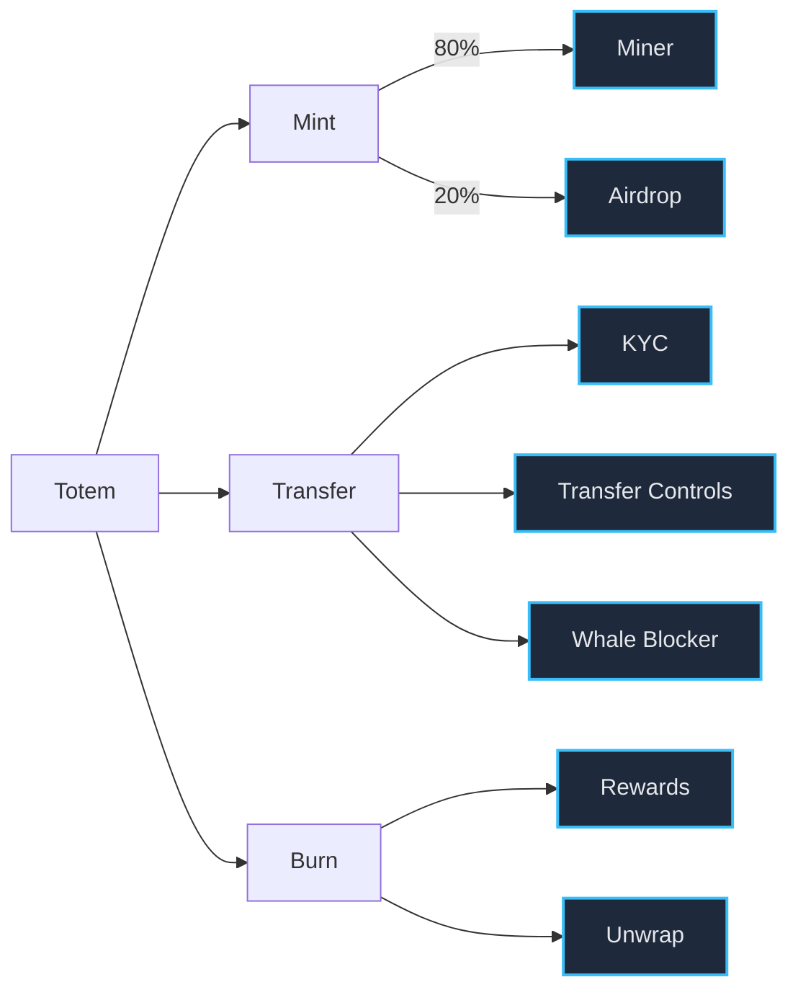
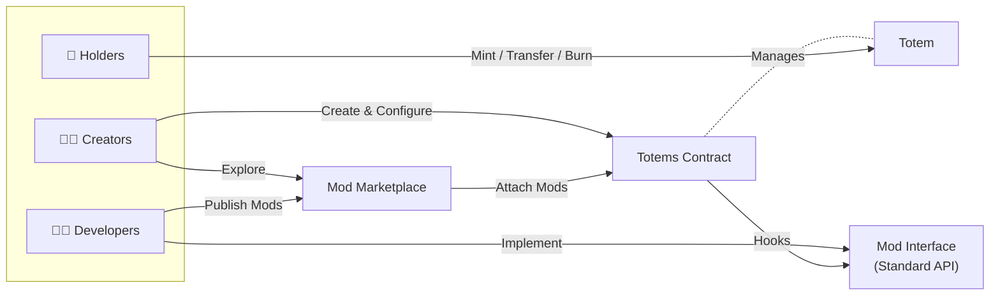
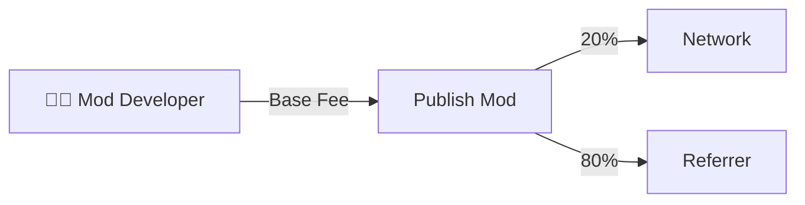
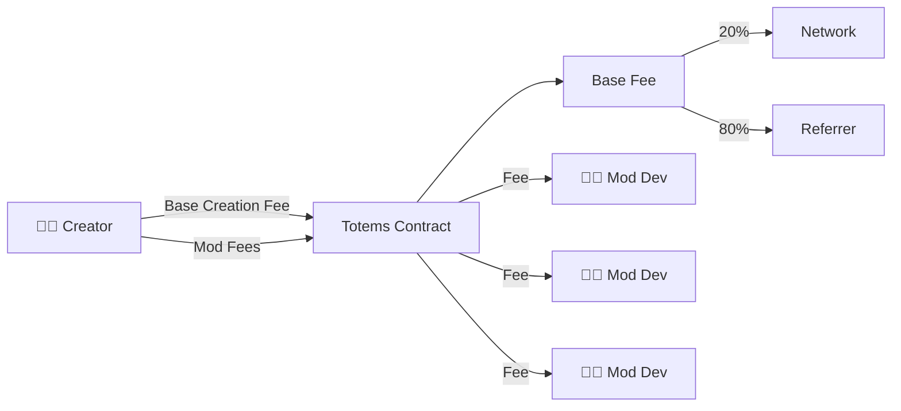
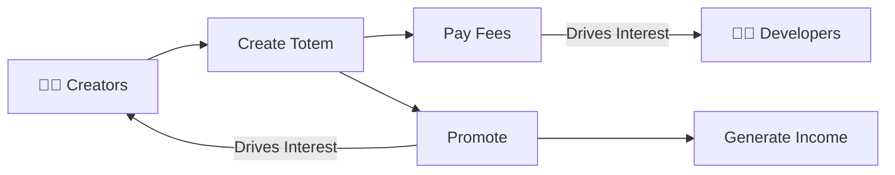
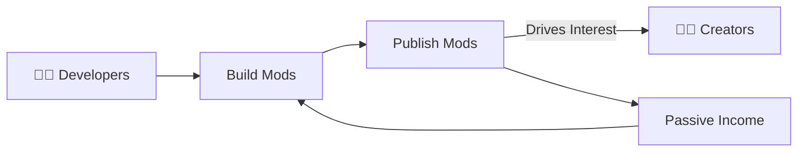
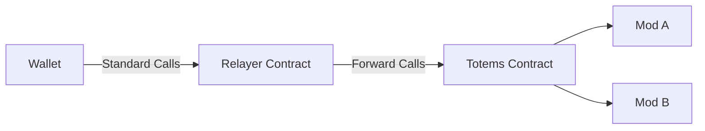
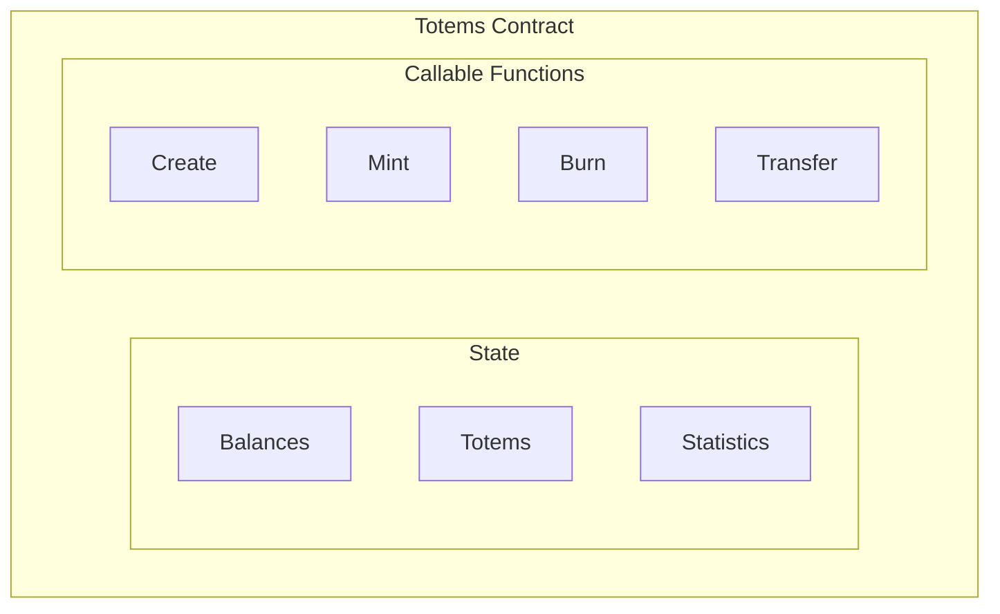

# Totems – Whitepaper

I would love feedback on this!
Feel free to open issues here, or join the [Telegram](https://t.me/totemize) group to discuss.

## Abstract

Totems is a blockchain-agnostic modular token standard that unlocks creators to 
build truly customized tokens with infinite possibilities without writing a single line of code,
and enabling a flywheel economy for both developers and creators.

Developers can build Mods of any type to extend token functionality that creators can then mix 
and match from an on-chain marketplace allowing them to craft unique token experiences that 
fit their vision and community's needs.

By separating token core functionality from extensible features through a plugin architecture,
Totems enable unprecedented flexibility without sacrificing security.

### High-Level Benefits

- **Creators**: Build custom tokens without coding, lower costs, faster time-to-market
- **Developers**: Monetize reusable components, reach more projects, focus on innovation
- **Users**: Access to better tokens, features, security, and custom experiences
- **Ecosystem**: Increased innovation velocity, economic efficiency, decentralized development

**Every new Totem is a brand-new experiment in token design.**

Example Totem:


---

## Motivation

The token landscape has evolved dramatically since inception through endless standards, but has largely plateaued.

While current wide-spread standards democratized token creation, they remained rigid and require technical expertise to 
customize. Even in cases where tokens can be composed of multiple features, there is no long-tail which ensures that 
innovation continues to thrive, and it always results in centralized entities controlling the development and 
maintenance of these features.

- [OpenZeppelin's Wizard](https://wizard.openzeppelin.com/) allows a rigid set of pre-defined features to 
  be toggled on/off at creation time, but this is limited to a small set of options and does not allow for 
  third-party extensibility.
- [Solana's Token 2022](https://www.solana-program.com/docs/token-2022) introduces extensions, but are also limited 
  to only what is available in the core implementation, and do not allow for third-party code.
- [EIP-777](https://eips.ethereum.org/EIPS/eip-777) introduces hooks, but does so in a way that burdens the users of 
  the tokens instead of giving power to creators, and lacks a marketplace or monetization model for developers.
- [EIP-1363](https://eips.ethereum.org/EIPS/eip-1363) introduces a form of callbacks, but is limited to only transfers 
  and does not provide a full lifecycle hook system or extensibility model.

There are many more attempts, but they all share similar limitations: they are either too rigid,
too complex, too focused, or lack a sustainable economic model for developers and/or centralize control over features.

Looking at this from the creator's perspective, the current landscape is challenging, and they are left with only a 
few less than desirable options:
- Pay for and deploy entirely new smart contracts every time (expensive, risky, time-consuming)
- Fork existing contracts and modify them (unknown burdens, maintenance reliance, coding knowledge required)
- Compromise on their vision by using off-the-shelf solutions with limited customization

And most importantly:
- There is no way to mix-and-match features from different sources into a single token
- There is no end-to-end UI to make customizable token creation accessible to non-technical users 

Meanwhile, developers who build innovative token mechanisms also have very limited options to monetize 
their work in a sustainable way leading to stagnation and pooling of developer talent around existing concepts and 
standards instead of pushing the boundaries of what's possible with blockchain tokens.


## Core Concepts

**Totems** introduces a **modular token architecture** that separates core token functionality (balances, transfers, 
and supply management) from extensible features through a plugin system called **Mods**.

- **Totems** are tokens created by non-technical users through a standardized interface
- **Mods** are smart contracts built by developers that add custom functionality via lifecycle hooks
- **Mod Market** is an on-chain marketplace where Mods are published and can be used for a price
- **Hooks** allow Mods to observe and enforce rules on token lifecycle events

### Totem Structure


### Primary Components

1. **Totem Contract**: Multi-token contract with hook notification system
2. **Market Contract**: Mod marketplace for publishing, pricing, metadata, and discovery
3. **Mod Interface**: Standardized interface for building compatible Mods



### Fee Structure

There are three fee recipients in the Totems ecosystem:
1. **Referrers**: UIs & tools can receive a percentage of base creation fees for driving adoption
2. **Mod Developers**: Receive 100% of Mod fees whenever their Mods are used in token creation
3. **Network/Deployer**: Receives base creation fees to cover network costs and incentivize validators

When a **developer** publishes a Mod they must pay a one-time publishing fee, and they also set a one-time fee to use 
their Mod during Totem creation.



When a **creator** creates a Totem, they pay a base creation fee plus the sum of all selected Mod fees.
The mod fees are paid directly to the respective Mod developers, while the base fee is split between the network and
the referrer (if any).



> Note: The network fee acts as a spam control mechanism. However, letting those tokens go to waste is unwise, and I 
> believe in giving back to the chains that have given me so much over the years.
> 
> This _could_ be replaced by a deployer/company fee but goes against my goals of decentralization. What 
> happens to the network fee on each chain is dictated by that chain's own governance and model. It's entirely possible that it is 
> given to the foundation to support further innovation, back into a DAO treasury, used to help pay nodes, or burned.
> It will be up to that chain to decide how to allocate those tokens when Totems is deployed there.


### Flywheels

The network effects of Totems create a virtuous cycle for both creators and developers.





As more creators build tokens using Mods, developers earn revenue which they can reinvest into building
more innovative Mods, attracting even more creators to the ecosystem and so on and so forth.

I believe that this is the primary reason that attempts at modular token standards have failed in the past as there 
has been no ongoing incentive for developers to continue building and maintaining extensible features.

---

## System Architecture

```
┌─────────────────────────────────────────────────────────┐
│                    Creator Interface                    │
│                   (Web UI / CLI / API)                  │
└───────────────────────────┬─────────────────────────────┘
                            │
                            ▼
┌─────────────────────────────────────────────────────────┐
│                     TOTEMS CONTRACT                     │
│  ┌──────────────────────────────────────────────────┐   │
│  │  State (totems, balances, supply, metadata)      │   │
│  ├──────────────────────────────────────────────────┤   │
│  │  Actions:                                        │   │
│  │    create, mint, burn, transfer, created         │   │
│  ├──────────────────────────────────────────────────┤   │
│  │  Hooks:                                          │   │
│  │    Sends events to Mods                          │   │
│  └──────────────────────────────────────────────────┘   │
└─────────┬──────────────────────┬────────────────────────┘
          │                      │
          │                      └───────────┐
          ▼                                  ▼
┌────────────────────┐            ┌──────────────────────┐
│  MARKET CONTRACT   │            │   MOD CONTRACTS      │
│                    │            │                      │
│  - Mod Registry    │            │  Mod A  Mod B  Mod C │
│  - Publishing      │◄───────────│  Mod D  Mod E  ...   │
│  - Pricing         │            │                      │
│  - Discovery       │            │  Each implements:    │
│  - Validation      │            │  - Hook handlers     │
│                    │            │  - Custom logic      │
└────────────────────┘            └──────────────────────┘
```

The **Totems** contract is a multi-token implementation that manages token state, balances, supply, and metadata 
across all created Totems. This ensures that totem creation is lightweight and efficient, and also allows ensuring 
security for all tokens created through the standard.

Because this conflicts with some existing token standards that expect one contract per token, relayer contracts will 
be deployed to chains (like EVM) that require it to provide compatibility with existing tooling. These are tiny 
contracts that mimic standards (like ERC20) and forward calls to the Totems contract. Because the hash of these 
contracts can be checked on-chain, Totems can verify that they are legitimate relayers.





> Note: Things like allowances (ERC20 approve/transferFrom) are intentionally omitted from the core design as they 
> are not needed within the core token functionality and can exist on relayers instead. This is done to keep the 
> standard applicable to all chains while still providing compatibility where needed.

### Mod Structure

```json
{
    "contract": "address/account",        // Mod contract address
    "seller": "address/account",          // Developer account
    "price": "uint",                      // Fee per use (in ecosystem tokens)
    "details": {                          // Metadata for UI
        "name": "string",                 // Human-readable name
        "summary": "string",              // Short description
        "markdown": "string",             // Long description (markdown or URL)
        "image": "string",                // Image URL (IPFS)
        "website": "string",              // Website URL
        "website_totem_path": "string",   // {website}/path/to/totem
        "is_minter": "bool"                // Whether this Mod can mint tokens
    },
    "hooks": "string[]"                   // Supported lifecycle hooks
}
```

The Mod Market holds a registry of published Mods with their metadata, pricing, and supported hooks.
This ensures that Totems can validate that selected Mods exist and support the requested hooks during token creation 
leading to atomic and valid token launches.

### Totem Structure

```json
{
    "symbol": "string",                   // Token ticker (unique)
    "decimals": "uint",                   // Decimal places
    "creator": "address/account",         // Creator account
    "supply": "uint",                     // Current circulating supply
    "max_supply": "uint",                 // Maximum possible supply
    "allocations": [                      // Initial distribution
        {
            "label": "string",            // Human-readable label
            "recipient": "address",       // Account receiving allocation
            "quantity": "uint",           // Amount allocated
            "is_minter": "bool"           // Whether recipient is a minter Mod
        }
    ],
    "mods": {                             // Mod configuration per hook
        "created": "address[]",           // Mods notified on creation
        "mint": "address[]",              // Mods notified on mint
        "burn": "address[]",              // Mods notified on burn
        "transfer": "address[]"           // Mods notified on transfer
    },
    "details": {                          // Metadata
        "name": "string",
        "description": "string",
        "image": "string",
        "website": "string",
        "seed": "sha256"                  // Helps mods and UIs add pseudo-randomness
    }
}
```

The Totems contract stores the state of each created Totem including its supply, allocations, metadata, and Mod  
configuration which is immutable after creation to ensure predictability and security for token holders.

> Note: There _is_ the possibility to have a "proxy mod" that allows mutable mods managed by the token creator, but 
> there's a need to discriminate between immutable and mutable mods for token holders to have a reliable and 
> transparent source of truth.  

---

### Assurances

- Mods do not have the ability to directly modify them or change parameters from hooks.
- Balances and supply can only be changed via core actions (mint, burn, transfer).
- Mods can only observe and enforce rules via reverts.
- Creators assume the risk of Mod selection.


## Contract Immutability & Trust Model

Both the core contracts (totems/market) and the totems themselves have immutability considerations to take into 
account so that there can be a base level of trust and security for all participants.

The ability to upgrade contracts introduces uncertainty from participants, but the lack thereof can lead to 
unattended vulnerabilities, and with a surface as large as a multi-token standard that concern is exponentially 
larger than a single token contract.

**Current Design: Immutability First**
- Market contract is immutable after deployment
- Totems contract is immutable after deployment
- Totem configuration is immutable after creation

**Future Considerations:**
- Upgradeability via decentralized governance of the Totem and Market contracts
- Off-chain Mod curation and reputation systems to help creators select safe Mods
- Governance curated skip-list of mods that have been found to brick totems

### Security Assumptions

**Trust Model:**
- **Totem Core**: Trustless (community-owned, audited, immutable logic)
- **Market Contract**: Trustless (community-owned, validation-only)
- **Mods**: Variable trust (third-party developed, reputation-based)

**Mod Security:**
- Mods are NOT trusted by default
- Mods can only observe and enforce rules via reverts
- Mods CANNOT directly modify Totem state (balances, supply)
- On some chains Mods can require additional transaction actions (e.g., storage payments)

---

## Examples of Mods

Below is a non-exhaustive list of example Mods that can be built to extend Totem functionality to give developers an 
idea of the breadth of possibilities.

### Mint Mods

- **Fixed Price ICO**: Sell tokens at a constant price per token
- **Variable Price ICO**: Price changes based on time or demand
- **Bonding Curve**: Price increases as supply increases
- **Mining Mod**: Proof-of-work or proof-of-stake based minting
- **Airdrop Mod**: Eligible addresses can claim tokens
- **Wrapper Mod**: Mint tokens by depositing other assets
- **Staking Mod**: Lock tokens to earn minting rights

### Transfer Mods

- **KYC Mod**: Require identity verification to transfer
- **Whaleblock Mod**: Prevent holdings above a certain threshold
- **Cooldown Mod**: Enforce time delay between transfers
- **Freezer Mod**: Creator can freeze specific accounts, or all transfers
- **Whitelist Mod**: Only approved addresses can hold/transfer
- **Blacklist Mod**: Block specific addresses from holding/transferring
- **Transfer Limits Mod**: Enforce daily/monthly transfer caps
- **Governance Mod**: Require community vote for large transfers
- **Multi-Sig Mod**: Require multiple signatures for transfers
- **Burn on Transfer Mod**: Burn a percentage of tokens on each transfer

### Burn Mods

- **Rewards Mod**: Distribute burned tokens as rewards
- **Unwrap Mod**: Burn tokens to redeem underlying assets
- **Gamification Mod**: Burn tokens to unlock achievements or features
- **No-Burn Mod**: Disable burning for specific accounts, periods, or entirely
- **Time-Locked Burn Mod**: Schedule aggregate burns for future dates
- **Lottery Burn Mod**: Burn tokens to enter holders into a lottery for prizes
- **Burn-to-Mint Mod**: Burn tokens to mint a different token or asset
- **Community Burn Mod**: Allow community voting on burn events or rates

The combinations of these Mods can lead to an infinite variety of token behaviors.

---

## 12. Legal & Regulatory Disclaimer

**General Disclaimer:**
This whitepaper is for informational purposes only and does not constitute financial, legal, or investment advice. The Totems protocol is experimental software provided "as is" without warranties.

**No Investment Offering:**
This document does not constitute an offer or solicitation to purchase securities or investment products. Totems is a token standard, not a token itself.

**Regulatory Uncertainty:**
Blockchain technology and digital assets face evolving regulatory landscapes. Users should consult legal counsel in their jurisdictions.

**Compliance Responsibility:**
Creators using Totems are responsible for compliance with applicable laws, including securities regulations, tax obligations, and consumer protection laws.

**Mod Risk:**
Third-party Mods are not audited or endorsed unless explicitly stated. Users assume all risks associated with Mod selection and usage.

**No Guarantees:**
The Totems team makes no guarantees regarding:
- Future development or support
- Value or utility of any specific token
- Availability or functionality of services
- Protection against loss or theft

**Jurisdiction:**
Some jurisdictions may prohibit or restrict the use of blockchain technology, smart contracts, or digital assets. Users are responsible for compliance with local laws.

**Intellectual Property:**
The Totems codebase is open source. Brand names, logos, and trademarks are property of their respective owners.

---

## 13. Team & Contributors

**Core Team:**
- **nsjames** (GitHub: @nsjames) - Creator & Lead Developer

**Community Contributors:**
- Testnet participants providing feedback and bug reports
- Mod developers building ecosystem tools
- Documentation contributors

**Links:**
- Website: https://totems.fun
- GitHub: https://github.com/nsjames/totems

**Acknowledgments:**
- Open source smart contract developers whose work inspired this project
- Blockchain communities supporting innovation

---

**Document Version:** 1.0  
**Last Updated:** December 29, 2025  
**Status:** Development
